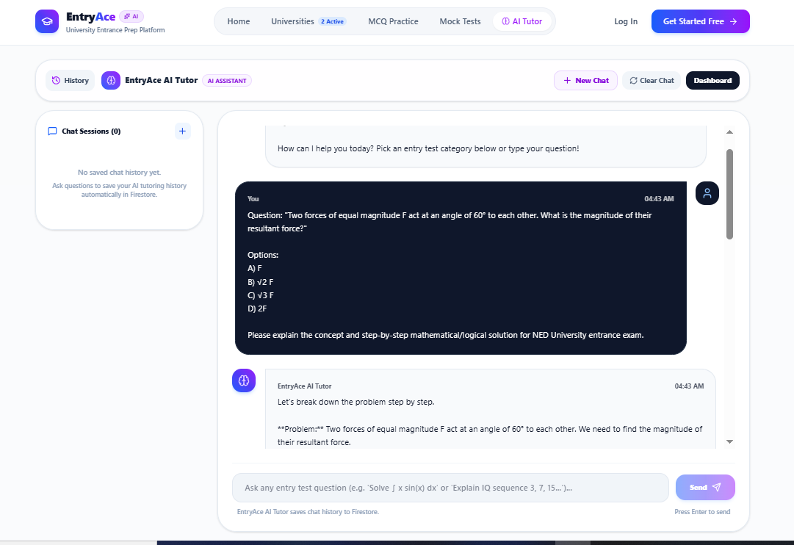
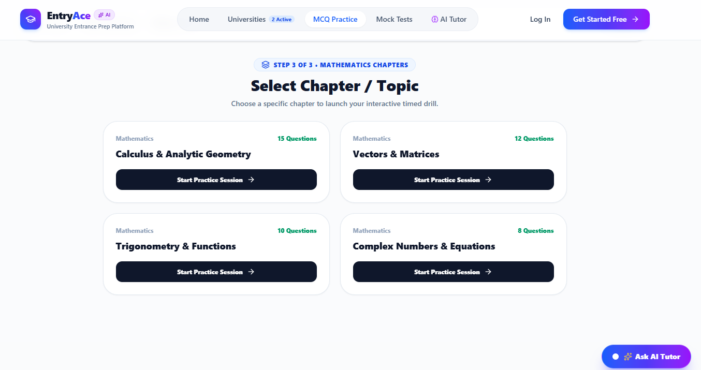

# EntryAce AI Tutor

## 🚀 Live Demo

https://entry-ace.vercel.app/

---

## 📌 About The Project

EntryAce AI Tutor is an AI-powered study assistant designed to help university entrance test students understand difficult concepts and prepare more effectively.

Many students preparing for exams like NED and FAST entry tests struggle with understanding questions and getting instant explanations. EntryAce solves this problem by providing an AI tutor that explains concepts in simple language and helps students learn step-by-step.

---

## ✨ Features

- AI-powered question explanations
- Instant concept clarification
- Simple and beginner-friendly explanations
- Entrance test focused AI tutoring
- Interactive learning support
- Responsive web interface
- Fast AI responses

---

## 🤖 AI Feature

EntryAce includes an AI Tutor that helps students understand academic questions.

The AI assistant is designed with custom instructions to behave like a university entry test tutor.

AI instructions include:

- Explain concepts clearly
- Use simple English
- Teach step-by-step
- Focus on understanding instead of only providing answers
- Help students prepare for entrance examinations

---

## 🛠️ Technologies Used

### Frontend
- React
- Vite
- Tailwind CSS
- TypeScript

### Backend
- Node.js
- Express.js

### AI Integration
- Groq API
- Llama 3.1 Model

### Deployment
- Vercel
- GitHub

---

## 📸 Screenshots

### Home Page


### AI Tutor



### Practice / App Interface



---

## ⚙️ How To Run Locally

Clone the repository:

```bash
git clone https://github.com/shuja4098/EntryAce.git